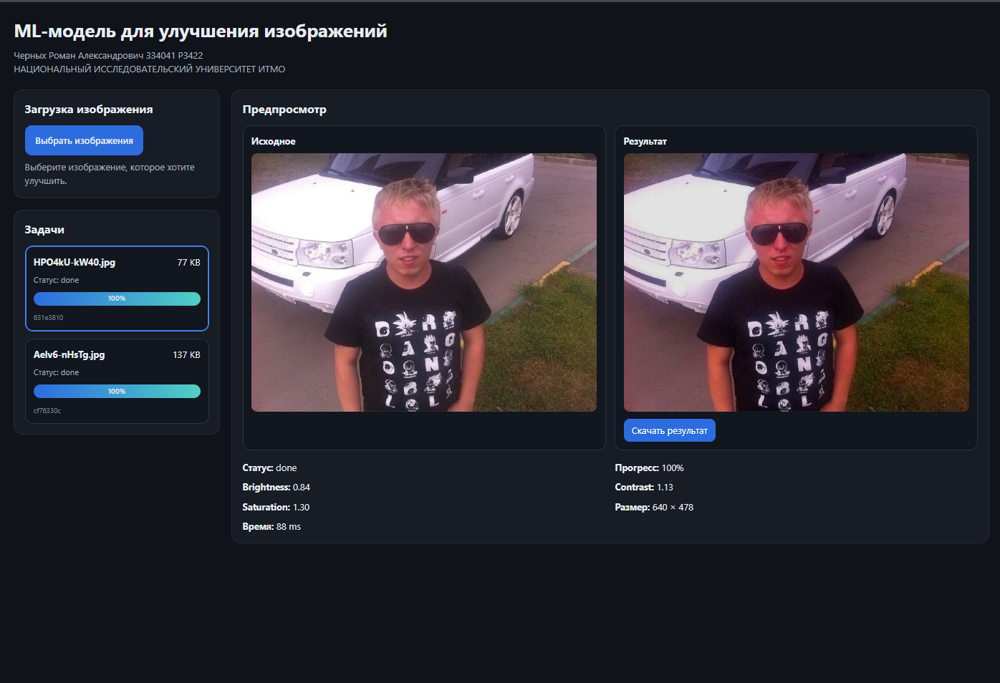

# ML-модель для улучшения изображений

Черных Роман Александрович, 334041  
P3422  
НАЦИОНАЛЬНЫЙ ИССЛЕДОВАТЕЛЬСКИЙ УНИВЕРСИТЕТ ИТМО

## Внешний вид проекта



## О проекте

Проект представляет собой веб-приложение для автоматического улучшения изображений прямо в браузере пользователя.  
Система анализирует входное изображение с помощью обученной ML-модели, предсказывает коэффициенты коррекции по трём параметрам и применяет их к исходной фотографии без использования серверного инференса.

Улучшение выполняется по следующим параметрам:

- яркость
- контрастность
- цветность

Итоговая обработка выполняется полностью на стороне клиента. Пользователь загружает изображение в интерфейс, после чего приложение создаёт задачу обработки, показывает её статус и прогресс, запускает модель в браузере и возвращает готовый результат с возможностью скачивания.

## Основной функционал

В проекте реализованы следующие возможности:

- загрузка изображений через веб-интерфейс;
- создание задачи на обработку изображения;
- отображение текущего статуса задачи;
- отображение прогресса выполнения;
- отмена активной задачи;
- просмотр исходного изображения;
- просмотр улучшенного результата;
- скачивание готового изображения;
- обработка изображений в браузере без блокировки пользовательского интерфейса;
- поддержка форматов JPG, JPEG, PNG, BMP, HEIC, HEIF.

## Как работает система

Обработка изображения в приложении выполняется по следующему сценарию:

1. Пользователь выбирает изображение в веб-интерфейсе.
2. Приложение создаёт новую задачу обработки и присваивает ей идентификатор.
3. Файл передаётся в `Web Worker`, чтобы не блокировать основной поток интерфейса.
4. На этапе декодирования:
   - стандартные форматы изображения открываются напрямую;
   - HEIC/HEIF при необходимости предварительно конвертируются в JPEG.
5. Для модели создаётся уменьшенная копия изображения фиксированного размера.
6. ML-модель предсказывает три коэффициента восстановления:
   - яркости,
   - контрастности,
   - цветности.
7. Предсказанные коэффициенты применяются уже к исходному изображению в полном разрешении.
8. Готовое изображение кодируется в выходной формат.
9. Пользователь получает:
   - обновлённый статус задачи,
   - прогресс выполнения,
   - результат обработки,
   - возможность скачать итоговый файл.

## Как обучалась модель

Для машинного обучения использовался подход регрессии глобальных параметров улучшения изображения.

### Общая идея обучения

Вместо обучения тяжёлой модели класса image-to-image была выбрана более практичная схема:  
модель предсказывает только три коэффициента коррекции изображения, а сами преобразования выполняются отдельным алгоритмом в браузере.

Это дало несколько преимуществ:

- уменьшение размера модели;
- снижение вычислительной нагрузки;
- возможность запуска в браузере;
- более простая интеграция в клиентское приложение.

### Данные для обучения

Для обучения использовался набор эталонно обработанных изображений из открытого [датасета](https://www.kaggle.com/datasets/weipengzhang/adobe-fivek).  
На этапе подготовки данных из эталонных изображений синтетически генерировались ухудшенные версии с изменением следующих параметров:

- яркость;
- контрастность;
- цветность.

Таким образом, для каждого примера обучения формировалась пара:

- эталонное изображение;
- ухудшенное изображение.

На основе коэффициентов применённой деградации рассчитывались целевые параметры восстановления, которые и предсказывала модель.

### Что предсказывает модель

Модель обучалась предсказывать не само улучшенное изображение, а вектор из трёх чисел:

- коэффициент восстановления яркости;
- коэффициент восстановления контрастности;
- коэффициент восстановления цветности.

В процессе обучения модель работала с логарифмами коэффициентов восстановления, а при инференсе в браузере выполнялось обратное преобразование с последующим применением итоговых значений к изображению.

### Итоговая ML-часть

Финальная модель представляет собой компактную сверточную нейросеть, обученную в `TensorFlow / Keras` и затем экспортированную для браузерного использования через `TensorFlow.js`. Процесс обучения находится в файле по пути: `training model/ML_photo_upgrader.ipynb`

## Технологии

### ML-часть

- Python
- TensorFlow
- Keras
- Google Colab

### Web-часть

- React
- Vite
- JavaScript
- CSS

### Выполнение модели в браузере

- TensorFlow.js
- Web Worker
- Canvas / OffscreenCanvas
- createImageBitmap

### Работа с форматами изображений

- нативное декодирование браузера для JPG / PNG / BMP
- `heic-to` для поддержки HEIC / HEIF

## Архитектура проекта

Проект разделён на несколько логических частей:

### 1. UI-уровень

Отвечает за:

- загрузку изображений;
- отображение списка задач;
- отображение прогресса;
- предпросмотр исходного и итогового изображения;
- скачивание результата.

### 2. API управления задачами

Отвечает за:

- создание задачи;
- хранение текущих статусов;
- отслеживание прогресса;
- отмену задач;
- передачу событий в интерфейс.

### 3. Worker-уровень

Отвечает за:

- декодирование изображения;
- предварительную подготовку входа для модели;
- запуск ML-модели;
- применение коэффициентов к изображению;
- экспорт результата.

### 4. ML-слой

Отвечает за:

- загрузку модели TensorFlow.js;
- подготовку входного тензора;
- получение предсказаний;
- нормализацию коэффициентов.

## Структура проекта

```text
ml_to_enhance_photos/
├── dist/                                # production-сборка проекта
├── node_modules/                        # зависимости
├── public/
│   ├── models/
│   │   └── photo_regressor/
│   │       ├── group1-shard1of1.bin     # веса модели TensorFlow.js
│   │       ├── inference_config.json    # конфигурация инференса
│   │       └── model.json               # описание модели
│   ├── screenshots/
│   │   └── main.png                     # скриншот интерфейса для README
│   ├── favicon.svg
│   └── icons.svg
├── src/
│   ├── app/
│   │   ├── App.jsx                      # корневой компонент приложения
│   │   └── main.jsx                     # точка входа
│   ├── assets/                          # статические ресурсы интерфейса
│   ├── features/
│   │   └── enhancer/
│   │       ├── api/
│   │       │   ├── taskEvents.js        # события задач
│   │       │   └── taskManager.js       # менеджер задач
│   │       ├── model/
│   │       │   ├── inferenceEngine.js   # загрузка и запуск ML-модели
│   │       │   ├── postprocess.js       # нормализация коэффициентов
│   │       │   └── preprocess.js        # подготовка входа для модели
│   │       ├── pipeline/
│   │       │   ├── applyAdjustments.js  # применение коэффициентов к изображению
│   │       │   ├── decodeImage.js       # декодирование и обработка форматов
│   │       │   └── exportImage.js       # экспорт результата
│   │       ├── ui/
│   │       │   ├── PreviewPane.jsx      # блок предпросмотра
│   │       │   ├── ProgressBar.jsx      # индикатор прогресса
│   │       │   ├── TaskList.jsx         # список задач
│   │       │   └── UploadPanel.jsx      # загрузка изображения
│   │       └── worker/
│   │           └── enhance.worker.js    # обработка изображения в worker
│   ├── shared/
│   │   ├── constants/
│   │   │   └── taskStatus.js            # статусы задач
│   │   └── utils/
│   │       ├── file.js                  # утилиты для работы с файлами
│   │       ├── id.js                    # генерация идентификаторов
│   │       └── image.js                 # вспомогательные функции изображения
│   └── styles/
│       └── index.css                    # глобальные стили
├── training model/
│   └── ML_photo_upgrader.ipynb          # блокнот обучения модели
├── .gitignore
├── eslint.config.js
├── index.html
├── package.json
├── package-lock.json
├── README.md
└── vite.config.js